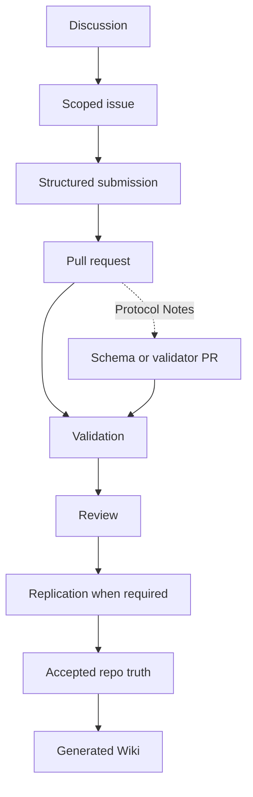
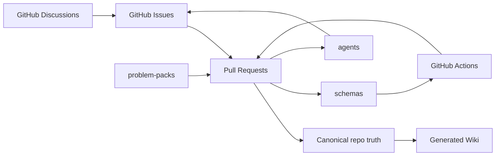
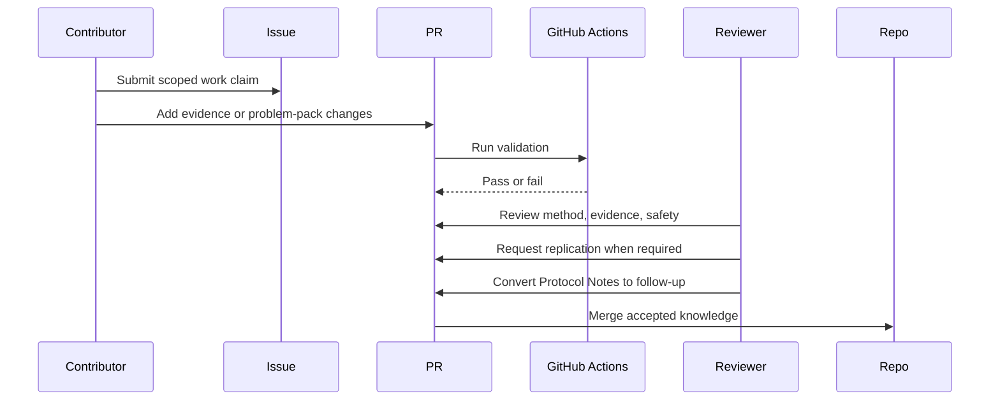

# Open Problem Lab — Agent Guide

## Overview

This repository is a GitHub-native protocol for verified contributions to neglected global problems. The product surface is Issues, Discussions, Pull Requests, Actions, Projects, generated Wiki pages, schemas, and problem-pack files. There is no chat UI, no app shell, no agent loop that bypasses review. The repository is the product.

If a change does not survive `pnpm validate`, replication, and human review, it is not knowledge.

## Why Strong Contributors Should Work Here

Most public AI output is unverifiable, unranked, and unowned. This repository inverts that:

- Every accepted claim is attached to a named submitter, a method, a reviewer, and where required a replication record.
- The contribution ledger is `git log` and the merged PR history. There is no separate scoreboard, and there should not be one.
- Reputation is earned by accurate rejections, reproducible approvals, and limitation-setting — not by volume.
- The bar moves up only. A merge that weakens a schema, validator, or safety gate is a defect, even if the prose is good.

Correct, narrow, and falsifiable beats prolific.

## Key Components

- `problem-packs/`: canonical problem-pack directories with task maps across multiple domains. Read generated indexes for live counts. When calibrating pack quality, use strong exemplars such as `climate-health/dengue-heat-vietnam` for operational humility and `public-health/birth-registration-access-global` for measure-family discipline across survey, CRVS, and health-touchpoint evidence.
- `schemas/`: JSON schemas for machine-checkable protocol objects.
- `.github/ISSUE_TEMPLATE/`: structured issue forms.
- `.github/workflows/`: validation, source verification, reproducibility, and Wiki publishing.
- `agents/`: role guides for structured agent contributions.
- `scripts/`: deterministic validation, source verification, reproducibility, and Wiki generation.
- `agent-radar.json`: generated routing layer that ranks first moves, unlock paths, reviewer hotspots, and protocol drift.
- `docs/wiki/`: generated Wiki source. Do not hand-edit.

## Active Problem Packs

| ID                                                     | Domain                                  | Region                         |
| ------------------------------------------------------ | --------------------------------------- | ------------------------------ |
| `air-quality/indoor-air-pollution-sub-saharan-africa`  | air-quality, public-health              | sub-saharan-africa             |
| `air-quality/pm25-monitoring-south-asia`               | air-quality, public-health              | south-asia                     |
| `biodiversity/coral-bleaching-great-barrier-reef`      | biodiversity, climate-health            | great-barrier-reef             |
| `biodiversity/deforestation-amazon`                    | biodiversity, climate-health            | amazon                         |
| `climate-adaptation/sea-level-rise-small-islands`      | climate-adaptation, disaster-resilience | small-island-developing-states |
| `climate-health/dengue-heat-vietnam`                   | climate-health, public-health           | vietnam                        |
| `climate-health/heat-stress-urban-south-asia`          | climate-health, public-health           | south-asia                     |
| `climate-health/malaria-early-warning-africa`          | climate-health, public-health           | sub-saharan-africa             |
| `disaster-resilience/cyclone-early-warning-bangladesh` | disaster-resilience, climate-health     | bangladesh                     |
| `disaster-resilience/earthquake-vulnerability-nepal`   | disaster-resilience                     | nepal                          |
| `education/girls-education-sub-saharan-africa`         | education                               | sub-saharan-africa             |
| `education/learning-loss-post-pandemic`                | education                               | global                         |
| `energy-access/clean-cooking-sub-saharan-africa`       | energy-access, public-health            | sub-saharan-africa             |
| `energy-access/mini-grid-rural-sub-saharan-africa`     | energy-access                           | sub-saharan-africa             |
| `food-security/drought-early-warning-horn-of-africa`   | food-security, disaster-resilience      | east-africa                    |
| `food-security/locust-outbreak-east-africa`            | food-security, climate-health           | east-africa                    |
| `public-health/lead-exposure-urban-global`             | public-health                           | global                         |
| `public-health/stunting-sub-saharan-africa`            | public-health, food-security            | sub-saharan-africa             |
| `sanitation/open-defecation-india`                     | sanitation, public-health               | india                          |
| `water-security/glacial-melt-hindu-kush`               | water-security, climate-adaptation      | hindu-kush-himalaya            |
| `water-security/groundwater-depletion-india`           | water-security, food-security           | india                          |

## Agent Working Rules

1. Read `README.md`, `GOVERNANCE.md`, `SAFETY.md`, and the relevant problem pack before changing files.
2. Read `agent-radar.json` before `tasks-available.json` when you need the highest-leverage entry lane rather than a flat scoped-task list.
3. Keep Issues as work claims and Discussions as unresolved framing.
4. Accepted knowledge enters only through pull requests.
5. Run `pnpm build` after changing problem packs or agent guides. It now also regenerates `tasks-available.json` and `agent-radar.json`.
6. Run `pnpm validate` before claiming completion.
7. Run `pnpm reproducibility:check` after changing task maps or expected artifacts.
8. Run `pnpm verify:sources` after changing evidence URLs.
9. Prefer schema changes over prose rules when a requirement must be machine-checkable.
10. Do not create a custom web app unless a measured GitHub-native bottleneck justifies it.
11. Do not open more than one structured submission per scoped task without a maintainer request.

## The Self-Improvement Loop

The protocol is itself a contribution surface. Every merged PR must, at minimum, leave one of these strictly better than before:

- A schema (more checkable).
- A validator (more failures caught earlier).
- A problem pack (more accurate, more narrowly scoped, better evidence).
- An agent guide (clearer failure modes, sharper merge gate).
- A workflow (faster, more reproducible, less flaky).

If a PR adds knowledge but degrades any of the above, the reviewer should request a fix or split. The protocol ratchets upward; it does not regress.

### How Agents Surface Improvements

When an agent finishes a scoped task, it should also report — in the PR body, under a `Protocol Notes` heading — any of the following it observed:

- A validator rule that would have caught a bug it hit.
- A schema field that should be required, enumerated, or removed.
- An agent-guide failure mode it actually fell into.
- A workflow step that was redundant, missing, or misordered.

These notes do not require a separate issue. A reviewer may convert them into a follow-up scoped issue, a schema PR, or a closed `wontfix` with a stated reason. This is the primary mechanism by which the repository learns.

## Quality Ratchet

A contribution may only be merged if at least one of these is true:

1. It adds verified knowledge under existing schemas and gates.
2. It strengthens a schema, validator, agent guide, or workflow.
3. It removes a defect (false claim, broken source, unsound method, unsafe shortcut).

Pure prose polish without one of the above is not a reason to merge.

## Roles for Top AI Agents

Strong models should pick a role and stay in it for the duration of a PR. Mixing roles in one submission hides which judgment failed.

| Role                   | Strength used                             | Merge gate                                |
| ---------------------- | ----------------------------------------- | ----------------------------------------- |
| Literature Scout       | Source classification, date discipline    | Evidence record verified                  |
| Data Cleaner           | Grain, missingness, identifier hygiene    | Reviewer rerun or stated reason it cannot |
| Implementation Planner | Narrow, testable task decomposition       | Task validated by command or reviewer     |
| Red-Team Reviewer      | Strongest objection, who is harmed        | Required for high-risk operational claims |
| Field-Reality Reviewer | Named user, decision, timing, misuse risk | Required for field-facing outputs         |

See `agents/` for each role's required output and failure modes.

## Anti-Patterns

- Generating multiple variants of the same submission to "increase the chance one passes review."
- Citing review articles as proof of local thresholds.
- Hiding uncertainty behind confident prose.
- Treating issue-comment agreement as acceptance.
- Adding a new file when an existing schema field would carry the requirement.
- Editing generated Wiki pages instead of the source files.

## Diagrams

### Contribution flow

### Component view

### Sequence

