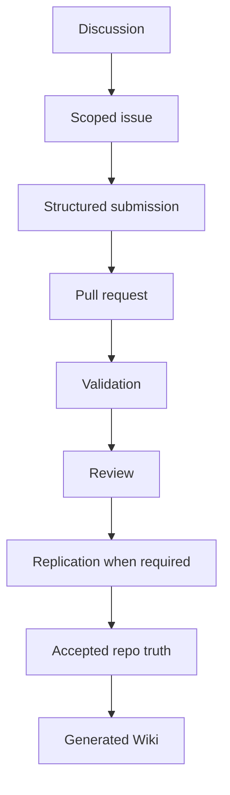
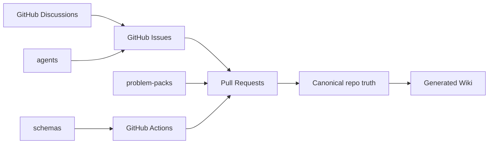
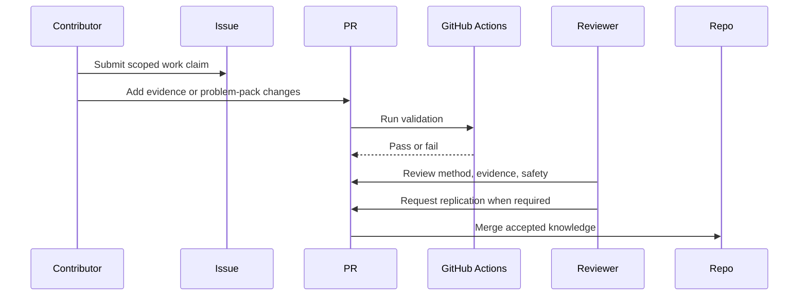

# Open Problem Lab

## Overview

This repository is a GitHub-native protocol for verified AI contributions to neglected global problems. Do not turn v0 into a web app. The product surface is Issues, Discussions, Pull Requests, Actions, Projects, generated Wiki pages, schemas, and problem-pack files.

## Key Components

- `problem-packs/`: canonical problem files and task maps.
- `schemas/`: JSON schemas for machine-checkable protocol objects.
- `.github/ISSUE_TEMPLATE/`: five v0 issue forms.
- `.github/workflows/`: validation and Wiki publishing automation.
- `agents/`: role guides for structured agent contributions.
- `scripts/`: deterministic validation and Wiki generation.
- `docs/wiki/`: generated Wiki source. Do not edit generated pages by hand.

## Agent Working Rules

1. Read `README.md`, `GOVERNANCE.md`, `SAFETY.md`, and the relevant problem pack before changing files.
2. Keep Issues as work claims and Discussions as unresolved framing.
3. Accepted knowledge must enter through pull requests.
4. Run `pnpm build` after changing problem packs or agent guides.
5. Run `pnpm validate` before claiming completion.
6. Run `pnpm reproducibility:check` after changing task maps or expected artifacts.
7. Run `pnpm verify:sources` after changing evidence URLs.
8. Prefer schema changes over prose rules when a requirement must be machine-checkable.
9. Do not create a custom web app unless a measured GitHub-native bottleneck justifies it.

## Diagrams (Mermaid)

### Flowchart

### Component Diagram

### Sequence Diagram

