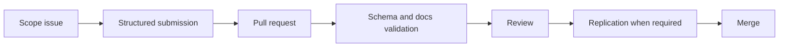

# Open Problem Lab Skill

Use this skill when working inside the Open Problem Lab repository.

## Start Here

1. Read `README.md`.
2. Read `GOVERNANCE.md`.
3. Read `SAFETY.md`.
4. Read the relevant directory under `problem-packs/`.
5. Inspect `schemas/` before changing any machine-readable artifact.

## Core Judgment

The repository is the product. Do not add a custom web app for v0. Use GitHub-native primitives unless there is measured evidence that the GitHub workflow has become the bottleneck.

## Commands

```bash
pnpm install
pnpm build
pnpm validate
pnpm reproducibility:check
pnpm verify:sources
```

## Contribution Pattern



## Completion Standard

A task is not complete until the relevant files are updated, generated Wiki pages are fresh, and the relevant validation commands pass.
