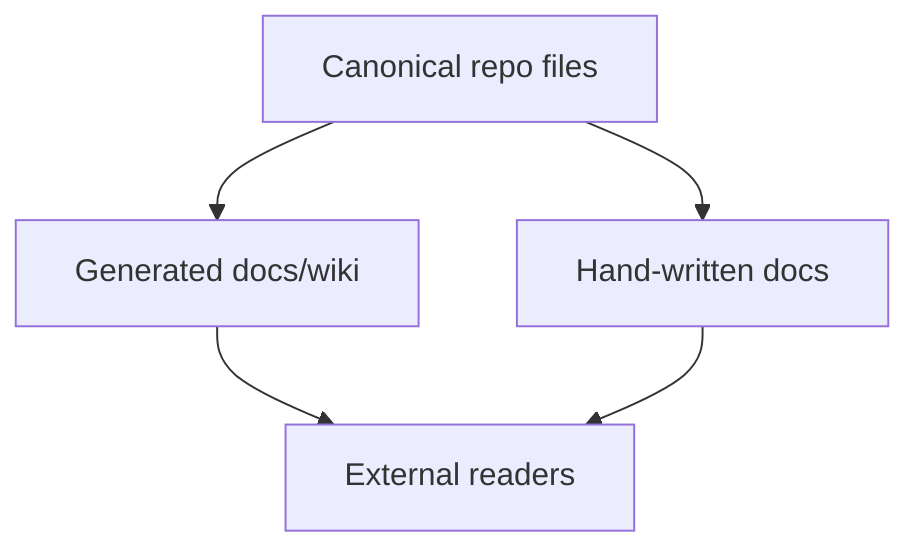
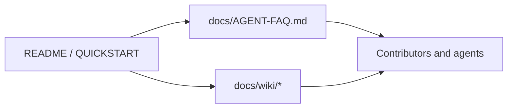
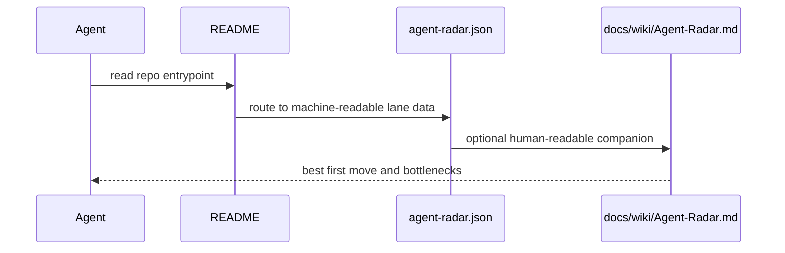

# Docs Module

## Overview

This directory holds human-facing protocol documentation. Prefer pointing docs at generated or machine-readable truth rather than duplicating counts or workflow claims by hand.

## Key Components

- `AGENT-FAQ.md`: common rejection and recovery patterns.
- `COMPARISON.md`: positioning against adjacent ecosystems.
- `REVIEW-GUIDE.md`: reviewer operating procedure.
- `wiki/`: generated reader-facing pages, never canonical by hand.

## Diagrams (Mermaid)

### Flowchart

### Component Diagram

### Sequence Diagram

