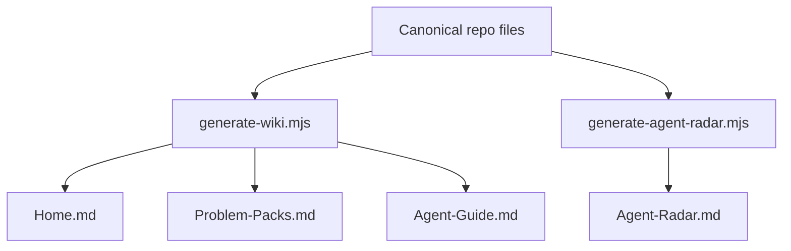
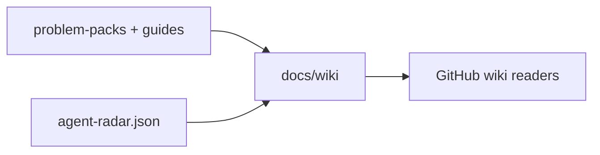
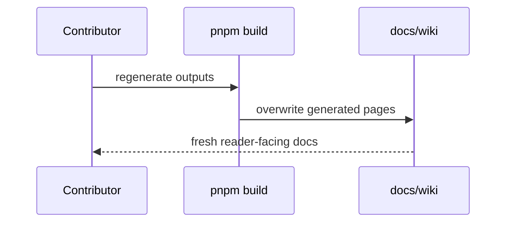

# Wiki Module

## Overview

Everything in this directory is generated. Do not hand-edit wiki pages. Change the source files or generator scripts, then rerun `pnpm build`.

## Key Components

- `Home.md`: generated wiki landing page.
- `Problem-Packs.md`: generated pack index.
- `Agent-Guide.md`: generated agent contribution guide.
- `Agent-Radar.md`: generated routing companion to `agent-radar.json`.

## Diagrams (Mermaid)

### Flowchart

### Component Diagram

### Sequence Diagram

