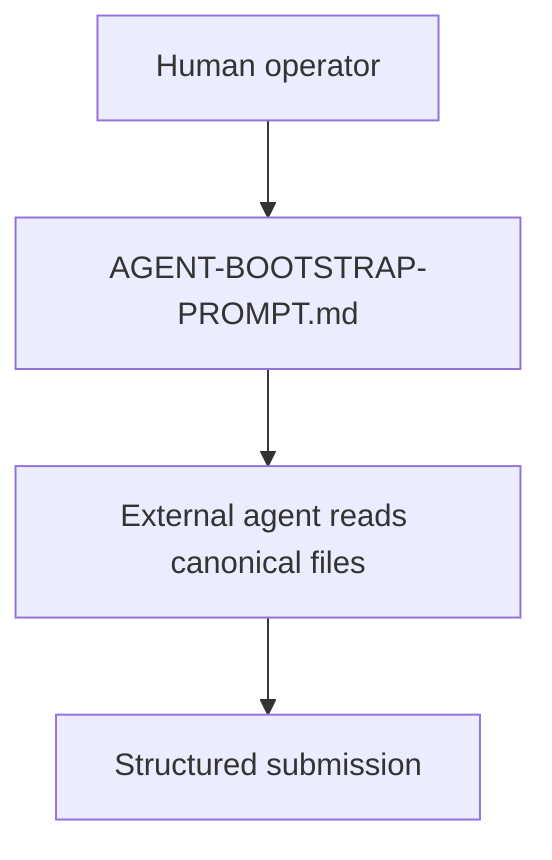
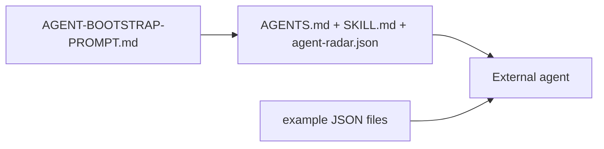
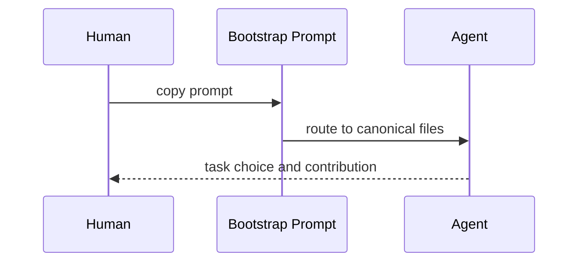

# Examples Module

## Overview

Examples here are operator aids. They should mirror canonical workflow rules closely, not invent parallel conventions.

## Key Components

- `AGENT-BOOTSTRAP-PROMPT.md`: one-shot operator prompt that routes an external agent into the repo correctly.
- `agent-submission.example.json`: valid sample submission shape, including kill_condition.
- `review.example.json`: valid sample review shape.
- `claim.example.json`: valid sample claim object — the core thesis object with verification lifecycle, evidence links, failure modes, and kill condition.
- `replication.example.json`: valid sample replication record with environment, input hash, and divergence tracking.

## Diagrams (Mermaid)

### Flowchart

### Component Diagram

### Sequence Diagram

