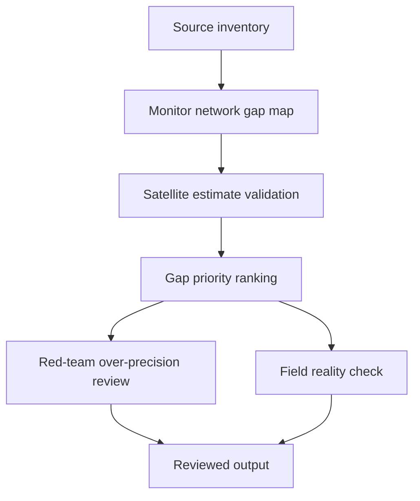

# Task Map

## Active Work Claims

The machine-readable task list is `tasks.json`.

## Work Sequence

## Merge Discipline

Work may happen in parallel, but accepted outputs must preserve this order:

1. Evidence before model.
2. Monitor network map before gap analysis.
3. Satellite validation before gap filling.
4. Gap ranking before deployment claim.
5. Red-team and field-reality review before publication.
