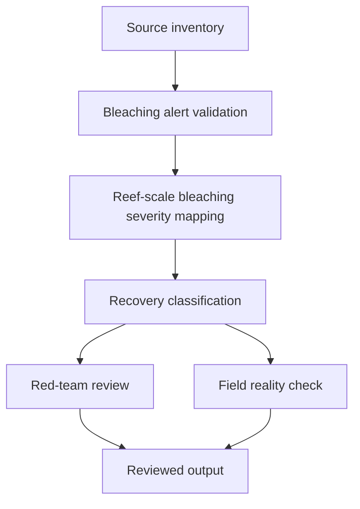

# Task Map

## Active Work Claims

The machine-readable task list is `tasks.json`.

## Work Sequence

## Merge Discipline

1. Evidence before model. 2. Satellite validation before severity claims. 3. Recovery tracking before management claims. 4. Red-team and field-reality review before publication.
