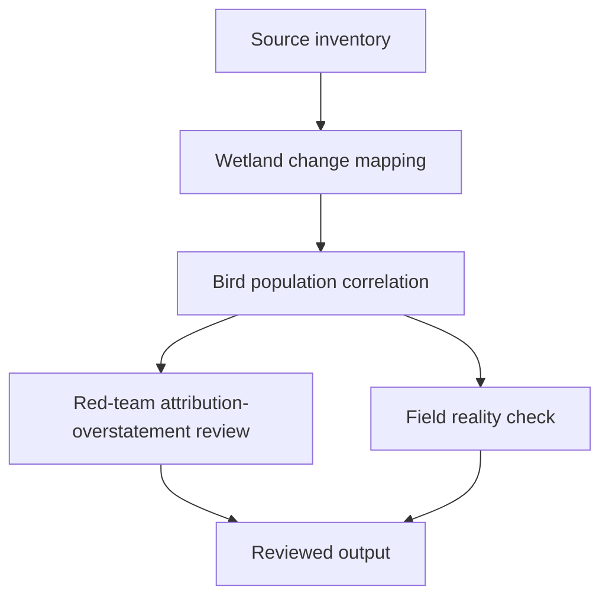

# Task Map

## Active Work Claims

The machine-readable task list is `tasks.json`.

## Work Sequence

## Merge Discipline

Work may happen in parallel, but accepted outputs must preserve this order:

1. Evidence before model.
2. Wetland-change detection at stopover sites before bird-population correlation.
3. Bird-population correlation before flyway-scale attribution claims.
4. Red-team review before field-facing output.
5. Field-reality review before publication.
