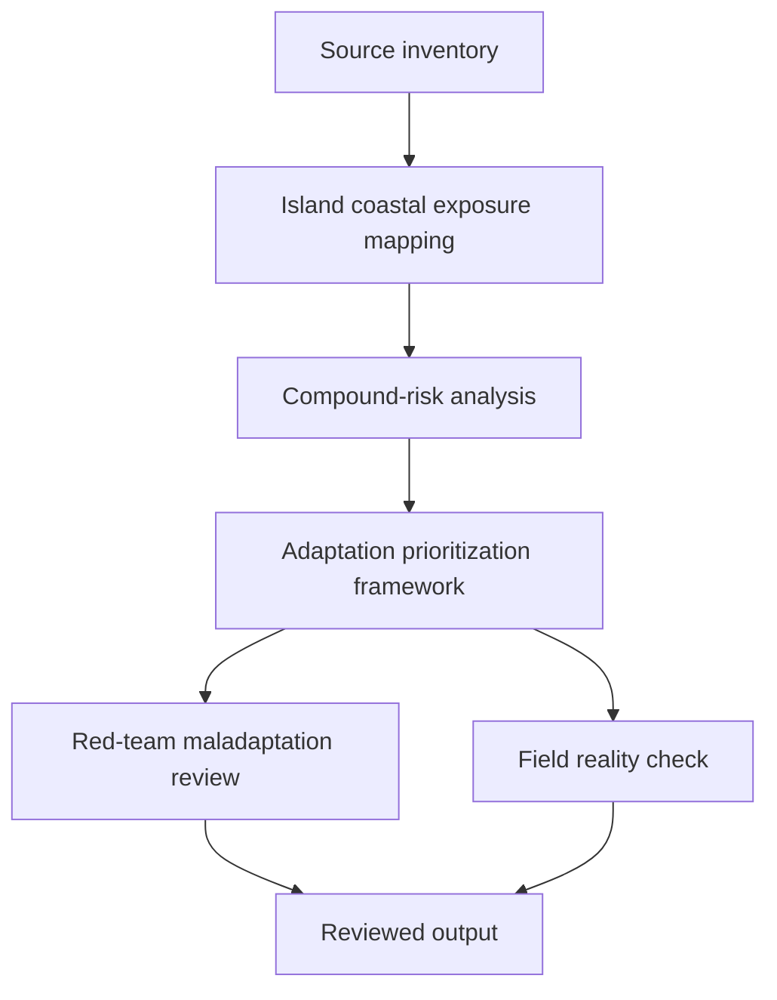

# Task Map

## Active Work Claims

The machine-readable task list is `tasks.json`.

## Work Sequence

## Merge Discipline

Work may happen in parallel, but accepted outputs must preserve this order:

1. Evidence before model.
2. Exposure mapping before risk analysis.
3. Compound-risk analysis before adaptation prioritization.
4. Red-team and field-reality review before any adaptation-facing output.
5. Field-reality review before publication.
