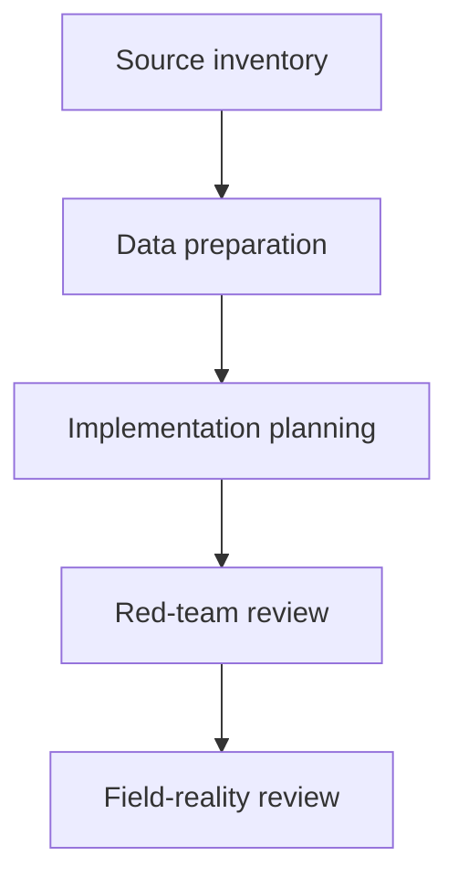
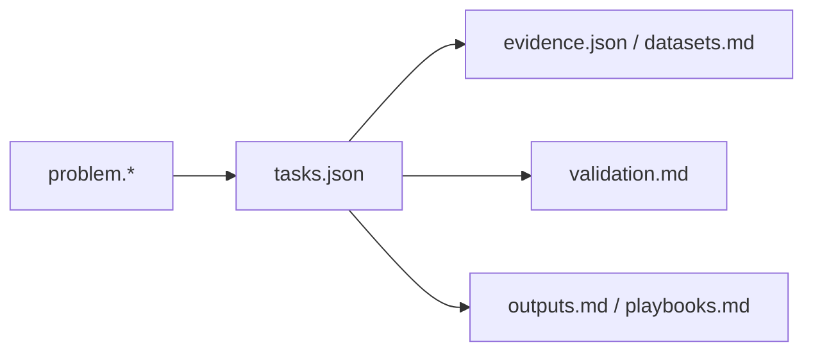
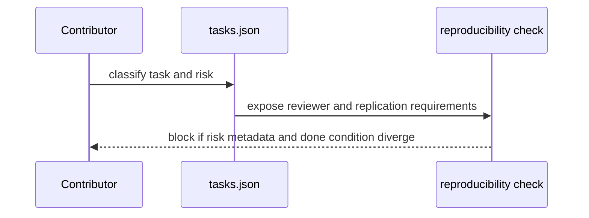

# Disaster Resilience Packs

## Overview

This domain contains packs where operational overclaim becomes dangerous quickly. Keep source-inventory tasks clearly separated from downstream operational modeling, and keep risk metadata aligned with that separation.

## Key Components

- Pack-local `problem.json` and `problem.md`: scope and safety framing.
- Pack-local `tasks.json`: role progression, reviewer routing, and risk staging.
- Pack-local `evidence.json`, `datasets.md`, `validation.md`, `outputs.md`: canonical evidence and downstream artifacts.

## Diagrams (Mermaid)

### Flowchart

### Component Diagram

### Sequence Diagram

