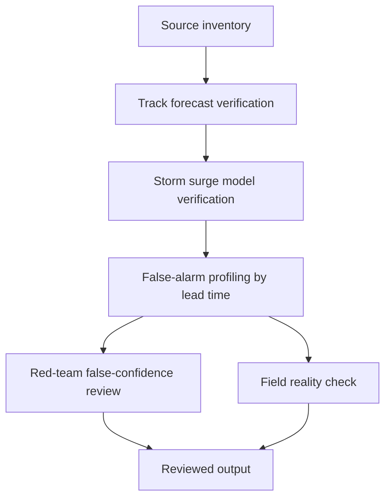

# Task Map

## Active Work Claims

The machine-readable task list is `tasks.json`.

## Work Sequence

## Merge Discipline

Work may happen in parallel, but accepted outputs must preserve this order:

1. Evidence before model.
2. Track verification before surge verification.
3. Surge verification before evacuation signal analysis.
4. False-alarm profiling before claim.
5. Red-team and field-reality review before publication.
