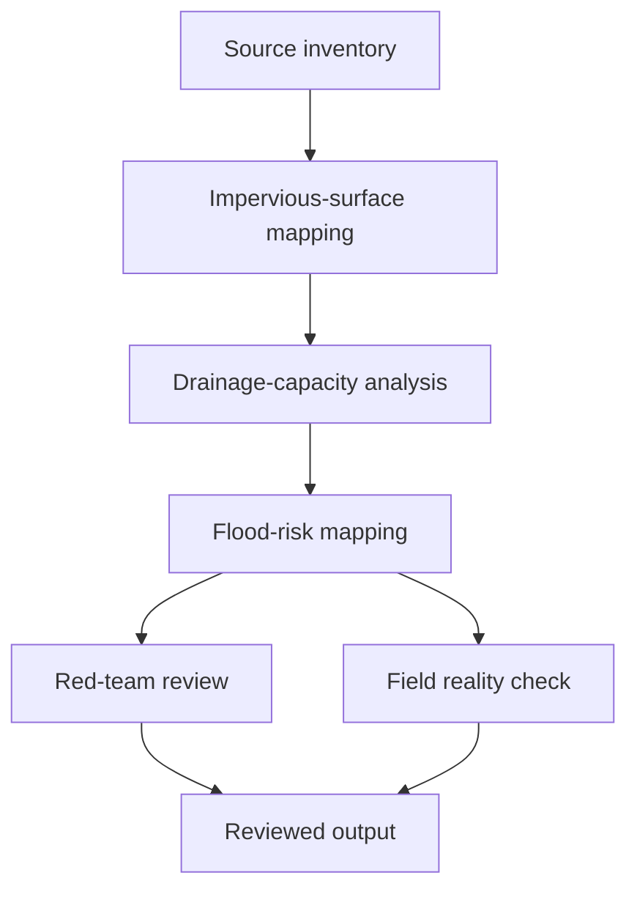

# Task Map

## Active Work Claims

The machine-readable task list is `tasks.json`.

## Work Sequence

```mermaid
flowchart TD
  A["Source inventory"] --> B["Impervious-surface mapping"]
  B --> C["Drainage-capacity analysis"]
  C --> D["Flood-risk mapping"]
  D --> E["Red-team review"]
  D --> F["Field reality check"]
  E --> G["Reviewed output"]
  F --> G
```
