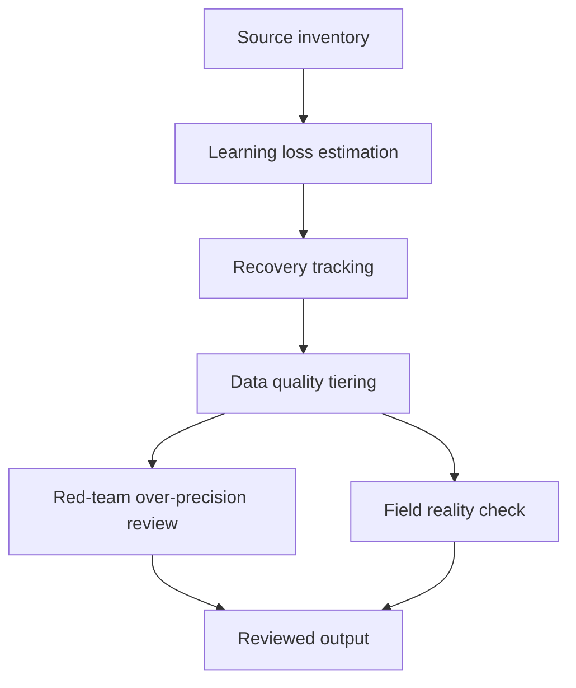

# Task Map

## Active Work Claims

The machine-readable task list is `tasks.json`.

## Work Sequence

## Merge Discipline

Work may happen in parallel, but accepted outputs must preserve this order:

1. Evidence before model.
2. Pre-pandemic baseline before loss estimate.
3. Loss estimate before recovery tracking.
4. Data-quality tiering before any policy claim.
5. Red-team and field-reality review before publication.
