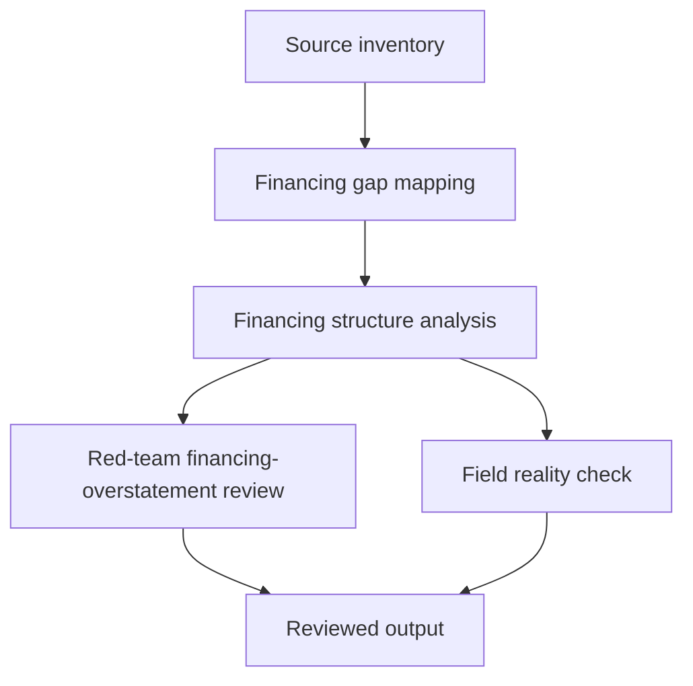

# Task Map

## Active Work Claims

The machine-readable task list is `tasks.json`.

## Work Sequence

## Merge Discipline

Work may happen in parallel, but accepted outputs must preserve this order:

1. Evidence before model.
2. Financing-gap mapping with sub-national data documentation before structure analysis.
3. Financing-structure analysis with missing-middle and volume-vs-access documentation before targeting claims.
4. Red-team review before field-facing output.
5. Field-reality review before publication.
