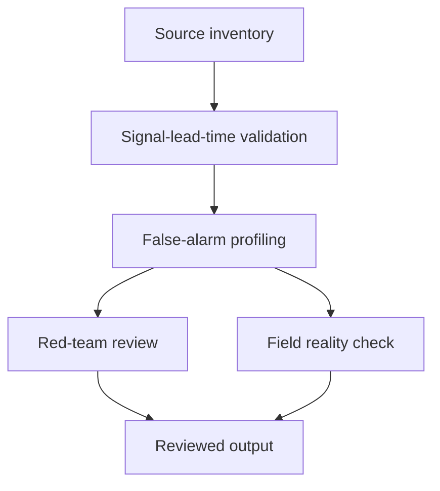

# Task Map

## Work Sequence

```mermaid
flowchart TD
  A["Source inventory"] --> B["Signal-lead-time validation"]
  B --> C["False-alarm profiling"]
  C --> D["Red-team review"]
  C --> E["Field reality check"]
  D --> F["Reviewed output"]
  E --> F
```

## Merge Discipline

1. Evidence before model. 2. Signal validation before food-insecurity claim. 3. Red-team and field-reality review before publication.
