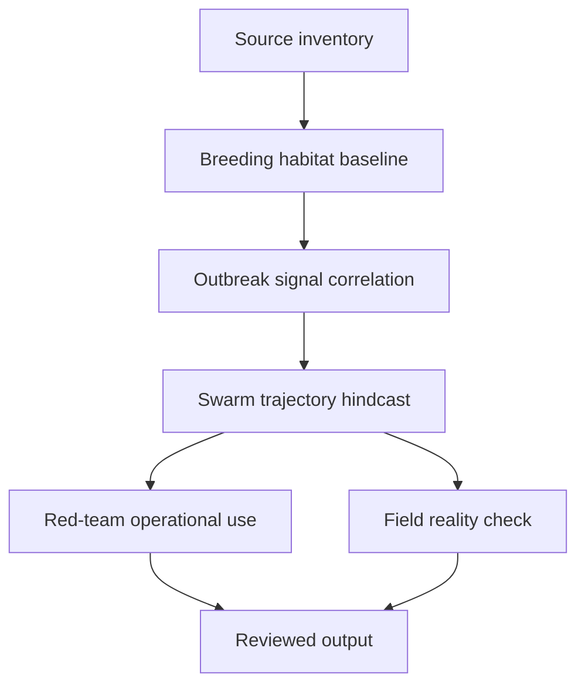

# Task Map

## Active Work Claims

The machine-readable task list is `tasks.json`.

## Work Sequence

## Current Status

- **Source inventory**: Completed. 10 evidence records, 12 sources classified (7 usable, 3 limited, 2 rejected). Data-sufficiency claim created with kill condition. Awaiting domain-reviewer review.
- **Breeding habitat baseline**: Scoped and ready for a data-cleaner. This is the next task in the pipeline. It depends on the source inventory being accepted.
- All other tasks remain needs-triage until the baseline is accepted.

## Merge Discipline

Work may happen in parallel, but accepted outputs must preserve this order:

1. Evidence before model.
2. Baseline before signal.
3. Hindcast before claim.
4. Red-team review before field-facing output.
5. Field-reality review before publication.
