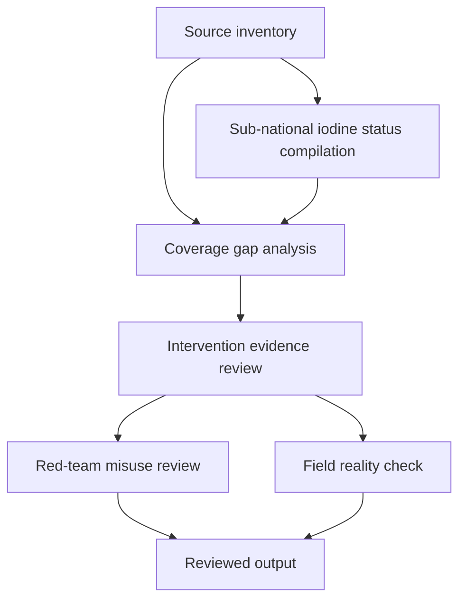

# Task Map

## Active Work Claims

The machine-readable task list is `tasks.json`.

## Work Sequence

## Merge Discipline

Work may happen in parallel, but accepted outputs must preserve this order:

1. Evidence before coverage estimate.
2. Sub-national data before gap analysis.
3. Gap analysis before intervention recommendation.
4. Intervention evidence before allocation recommendation.
5. Red-team review before field-facing output.
6. Field-reality review before publication.
