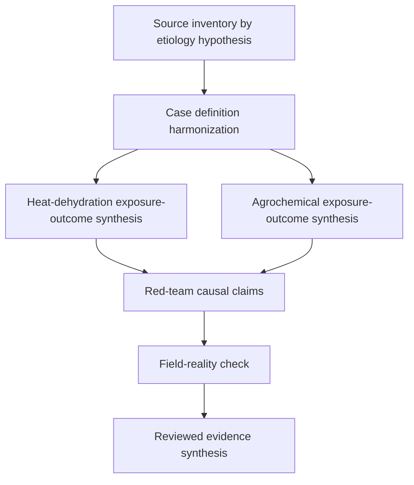

# Task Map

## Active Work Claims

The machine-readable task list is `tasks.json`.

## Work Sequence

## Merge Discipline

Work may happen in parallel, but accepted outputs must preserve this order:

1. Evidence before synthesis.
2. Case definition comparison before cross-region prevalence comparison.
3. Exposure-outcome synthesis before causal inference claim.
4. Red-team review before any policy recommendation.
5. Field-reality review before publication.

The heat-dehydration and agrochemical syntheses can proceed in parallel but must both be complete before the red-team review, because the red-team review must assess the relative evidence strength across hypotheses.
