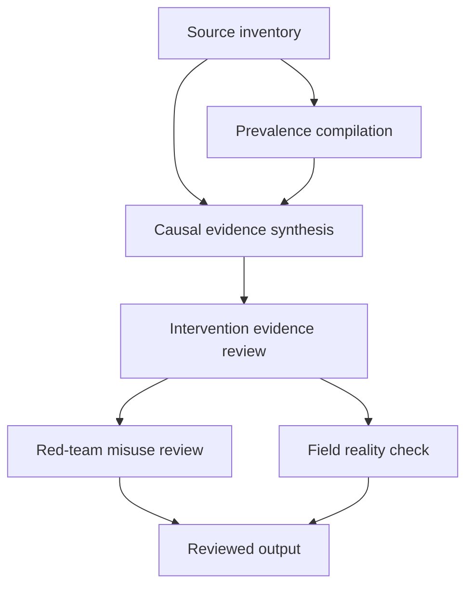

# Task Map

## Active Work Claims

The machine-readable task list is `tasks.json`.

## Work Sequence

## Merge Discipline

Work may happen in parallel, but accepted outputs must preserve this order:

1. Evidence before prevalence estimate.
2. Prevalence data before causal synthesis.
3. Causal synthesis before intervention review.
4. Intervention evidence before allocation recommendation.
5. Red-team review before field-facing output.
6. Field-reality review before publication.
