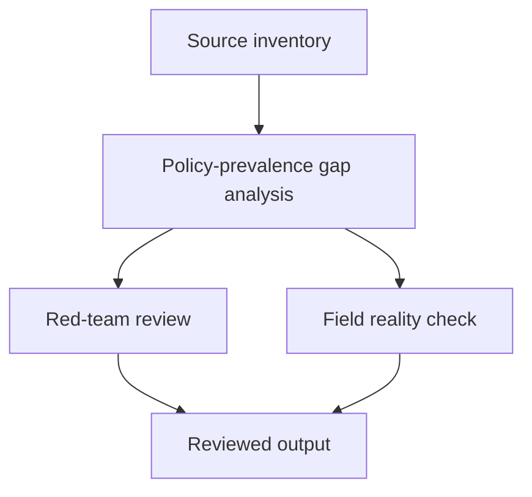

# Task Map

`tasks.json`

```mermaid
flowchart TD
  A["Source inventory"] --> B["Policy-prevalence gap analysis"]
  B --> C["Red-team review"]
  B --> D["Field reality check"]
  C --> E["Reviewed output"]
  D --> E
```
