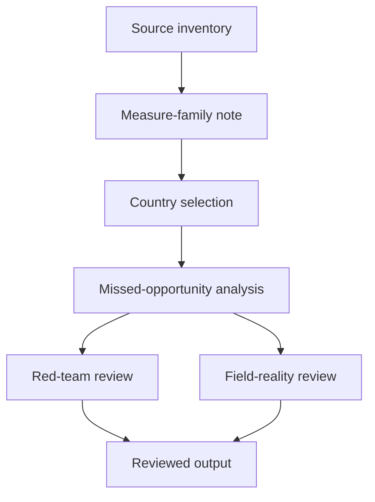
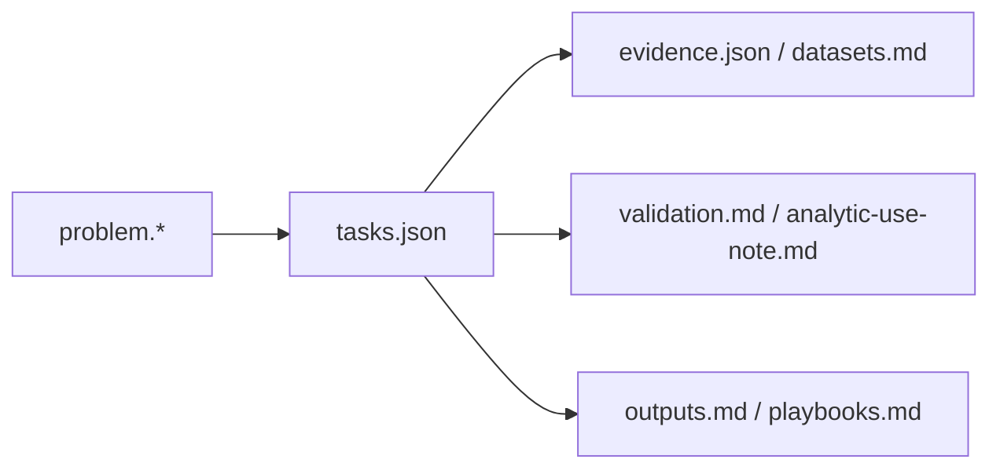
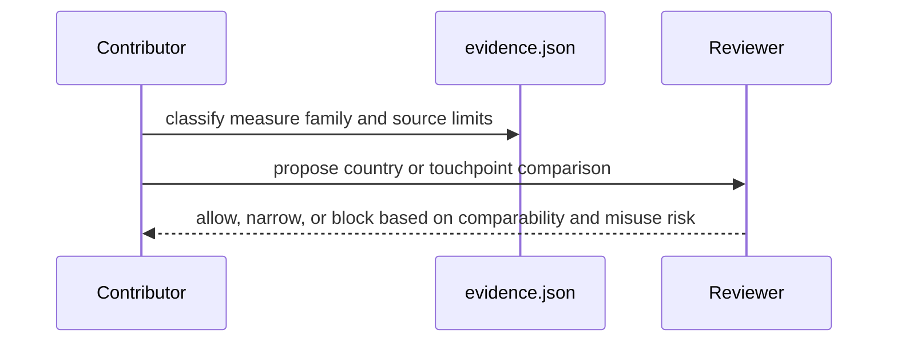

# Birth Registration Pack

## Overview

This pack exists to stop a common analytical error: treating survey-based under-5 birth-registration status, certificate possession, and administrative CRVS completeness as if they were one number.

Health-service linkage is allowed here only when the workflow is named. "Use the health system" is too vague to merge.

## Key Components

- `problem.md` and `problem.json`: pack scope, contrarian framing, and merge gates.
- `tasks.json`: sequencing from source inventory to measure reconciliation, country selection, and red-team review.
- `datasets.md` and `evidence.json`: canonical source inventory and evidence records.
- `outputs.md`, `playbooks.md`, `validation.md`, `analytic-use-note.md`: what can be published, how to attack it, and what must be blocked.

## Diagrams (Mermaid)

### Flowchart

### Component Diagram

### Sequence Diagram

