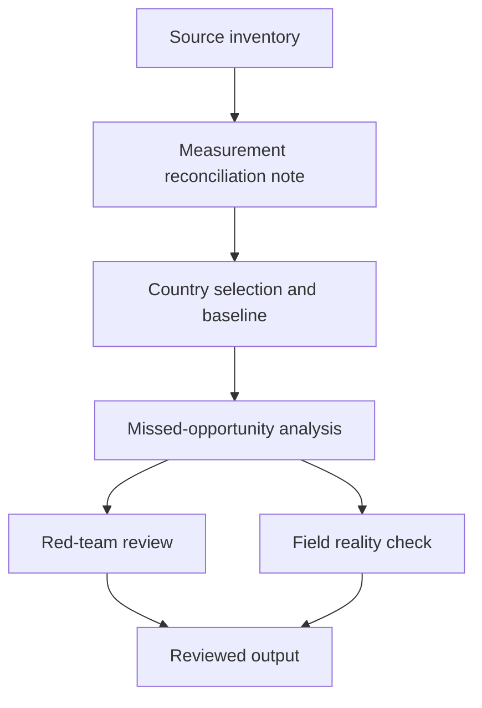

# Task Map

## Active Work Claims

The machine-readable task list is `tasks.json`.

## Work Sequence

## Merge Discipline

1. Evidence before comparison.
2. Measure-family reconciliation before sub-national ranking.
3. Country selection before analysis.
4. Red-team and field-reality review before publication.
