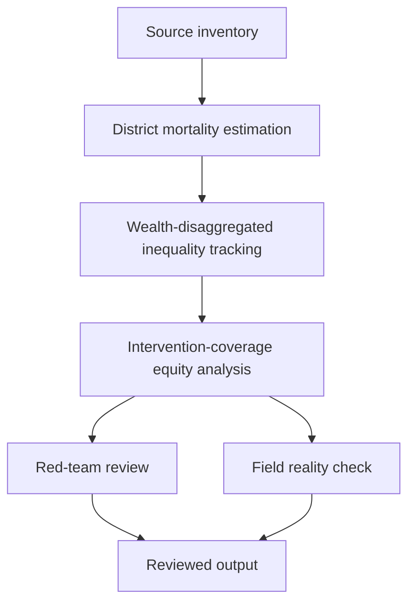

# Task Map

## Active Work Claims

The machine-readable task list is `tasks.json`.

## Work Sequence

## Merge Discipline

1. Evidence before model. 2. District-level estimation before inequality claims. 3. Inequality analysis before equity-policy discussion. 4. Red-team and field-reality review before publication.
