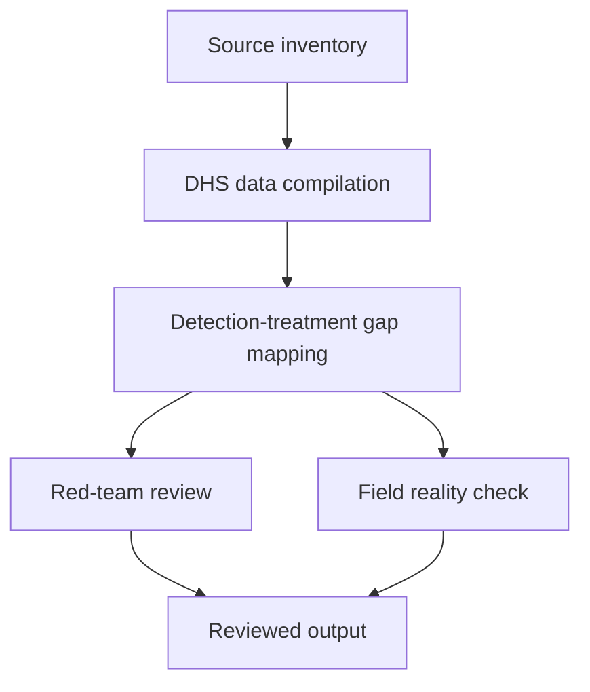

# Task Map

The machine-readable task list is `tasks.json`.

```mermaid
flowchart TD
  A["Source inventory"] --> B["DHS data compilation"]
  B --> C["Detection-treatment gap mapping"]
  C --> D["Red-team review"]
  C --> E["Field reality check"]
  D --> F["Reviewed output"]
  E --> F
```

## Merge Discipline

1. Evidence before model. 2. Red-team and field-reality review before publication.
