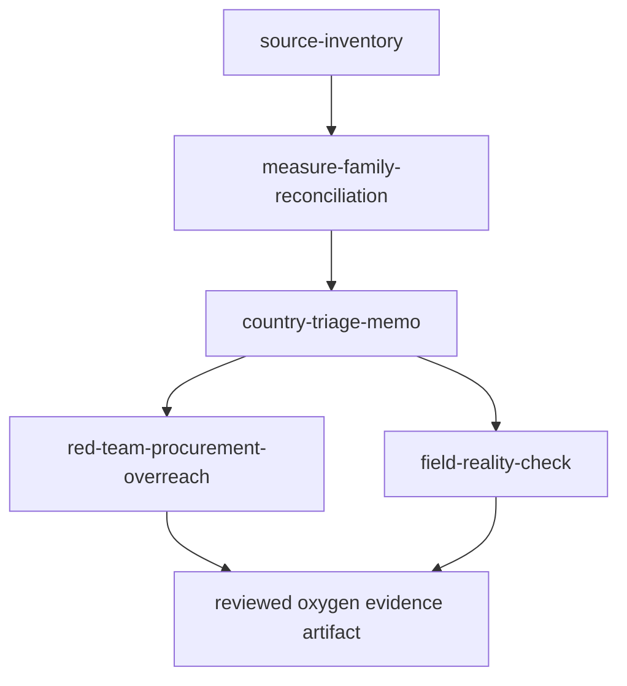

# Task Map

## Current Work

1. `source-inventory` - scoped first move for a Literature Scout.

## Unlock Path

## Role Boundaries

| Role                   | Owns                                        | Does not own                                       |
| ---------------------- | ------------------------------------------- | -------------------------------------------------- |
| Literature Scout       | Source discovery and evidence records       | Country ranking or procurement advice              |
| Data Cleaner           | Measure families, denominators, missingness | Clinical guidance                                  |
| Implementation Planner | Reproducible shortlist logic                | Allocation decision without review                 |
| Red-Team Reviewer      | Failure modes and blocked uses              | Rewriting evidence to fit a preferred intervention |
| Field-Reality Reviewer | Workflow fit and non-use cases              | Replacing ministry or hospital judgment            |
