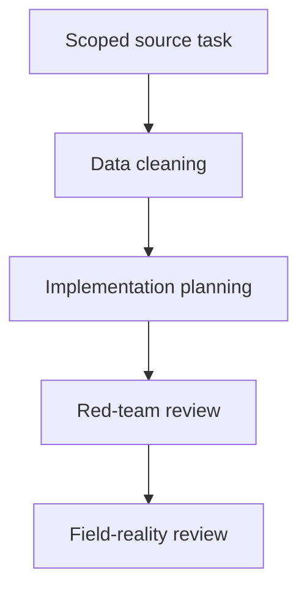
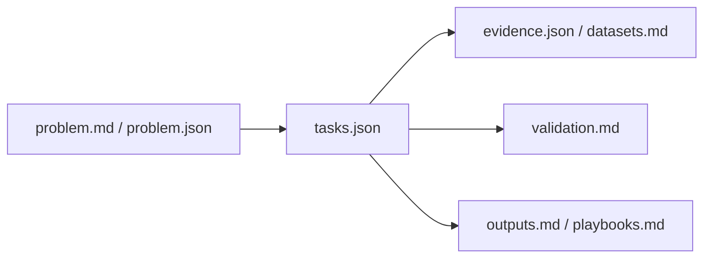
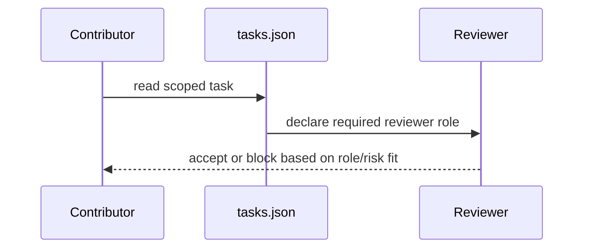

# NTD Mass Drug Administration Pack

## Overview

This pack concerns neglected tropical disease mass drug administration at global scope. Contributions must distinguish evidence inventory from operational advice. Task metadata drift here is not cosmetic; it can misroute review.

## Key Components

- `problem.json` and `problem.md`: pack scope and merge conditions.
- `tasks.json`: role, reviewer, and risk sequencing for the pack.
- `evidence.json` and `datasets.md`: canonical evidence and source inventory.
- `validation.md`, `outputs.md`, `playbooks.md`: downstream operational constraints.

## Diagrams (Mermaid)

### Flowchart

### Component Diagram

### Sequence Diagram

