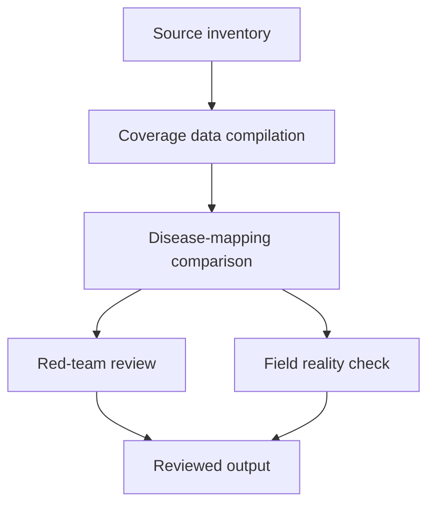

# Task Map

The machine-readable task list is `tasks.json`.

```mermaid
flowchart TD
  A["Source inventory"] --> B["Coverage data compilation"]
  B --> C["Disease-mapping comparison"]
  C --> D["Red-team review"]
  C --> E["Field reality check"]
  D --> F["Reviewed output"]
  E --> F
```
