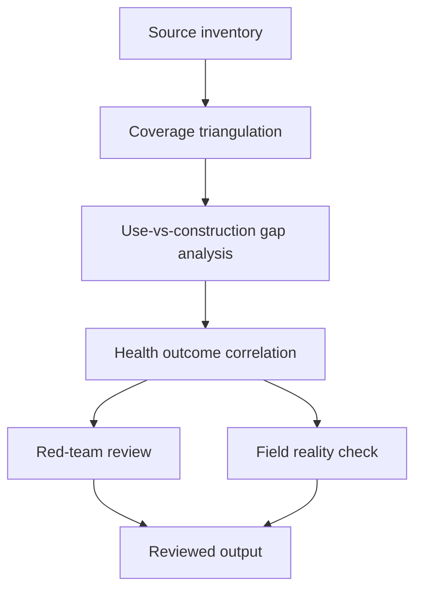

# Task Map

## Active Work Claims

The machine-readable task list is `tasks.json`.

## Work Sequence

## Merge Discipline

1. Evidence before model.
2. Triangulation before gap analysis.
3. Gap analysis before health claims.
4. Red-team and field-reality review before publication.
