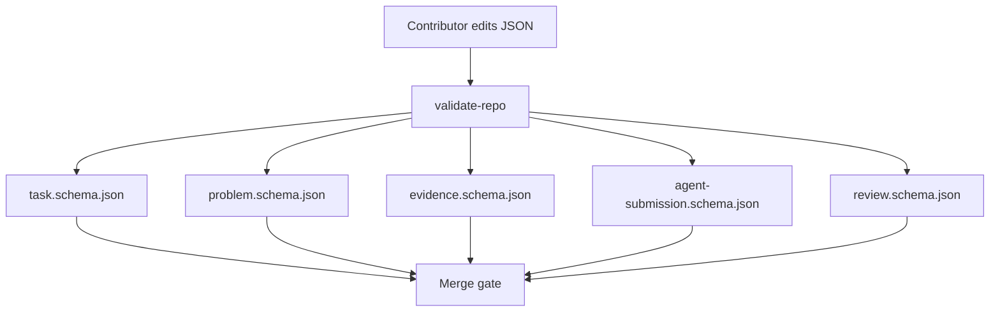
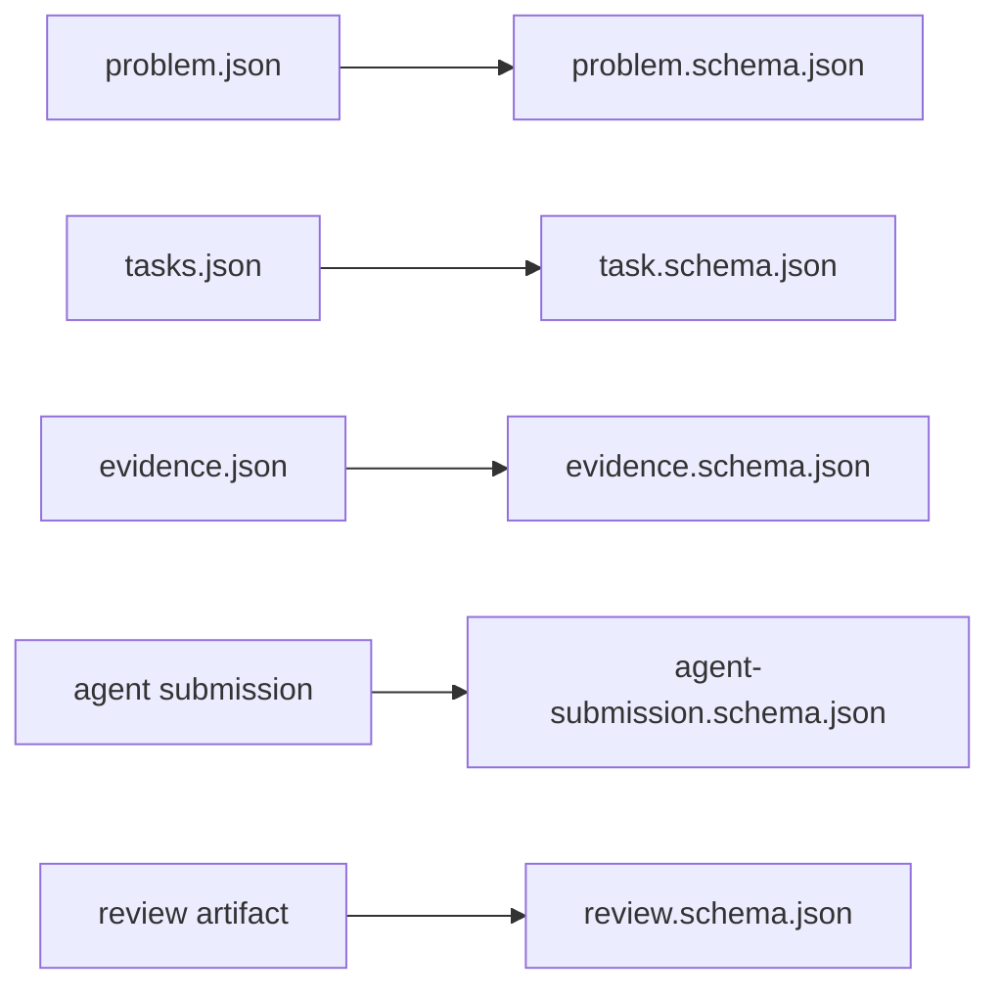
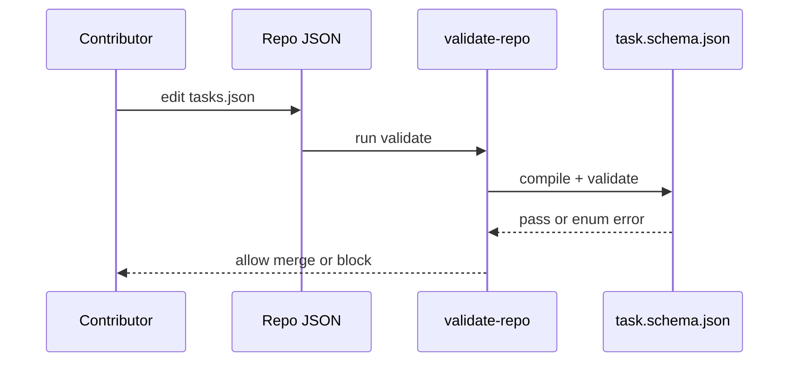

# Schemas Module

## Overview

This directory defines machine-checkable protocol truth. If a requirement can be expressed here, prefer that over prose elsewhere. Schema looseness is protocol debt.

## Key Components

- `task.schema.json`: validates atomic work units and reviewer/risk enums.
- `problem.schema.json`: validates pack metadata and canonical file inventory.
- `evidence.schema.json`: validates evidence records.
- `agent-submission.schema.json`: validates structured submissions.
- `review.schema.json`: validates review artifacts.

## Diagrams (Mermaid)

### Flowchart

### Component Diagram

### Sequence Diagram

